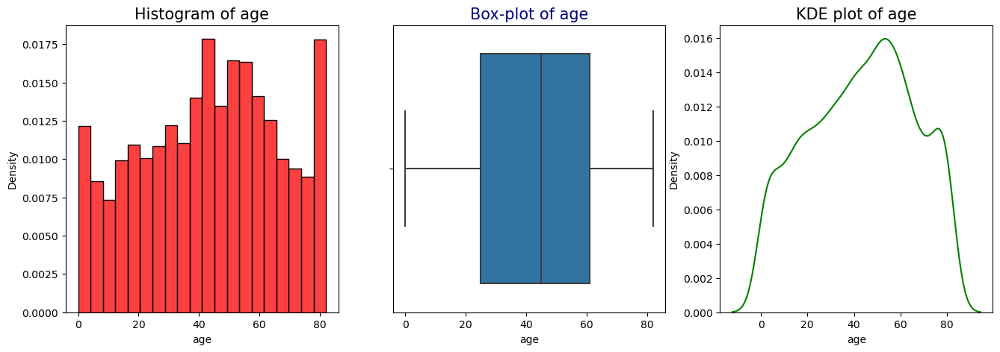

# 📊 Stroke Health Indicators

An exploratory data-analysis capstone examining demographic and health indicators in a stroke dataset. **By Joana Owusu-Appiah.**

## Explore

📓 [Open the notebook](python_capstone.ipynb) · 📖 [Workflow and data guide](docs/workflow.md)

## Setup

```bash
git clone https://github.com/Joana-Mansa/python_capstone_Stroke.git
cd python_capstone_Stroke
python -m venv .venv
source .venv/bin/activate
python -m pip install -r requirements.txt
jupyter lab python_capstone.ipynb
```

## Data

[Kaggle stroke prediction dataset](https://www.kaggle.com/datasets/fedesoriano/stroke-prediction-dataset). Save `healthcare-dataset-stroke-data.csv` beside the notebook. The original notebook describes 5,110 rows and 12 columns.

## Results and scope

The notebook explores missing values, age groupings, distributions and associations. This is exploratory analysis, not a validated diagnostic model. Saved plots do not establish causality. Dataset provenance and definitions should be reviewed before reusing demographic categories.



This preview was exported from the original notebook’s saved output.
